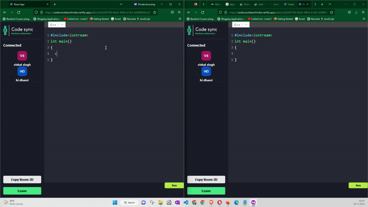
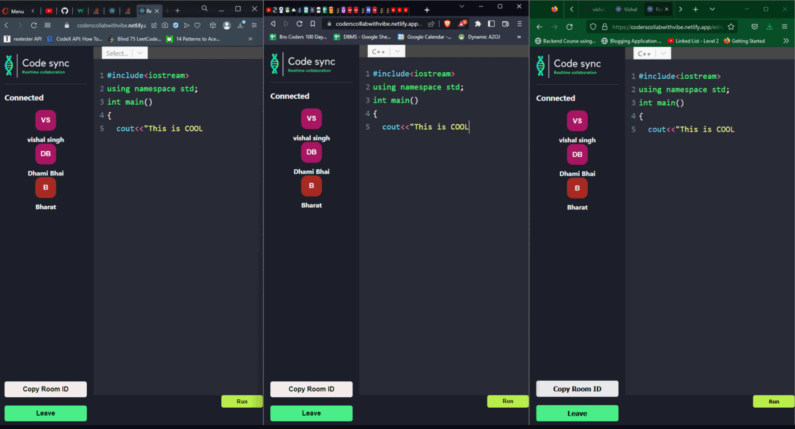
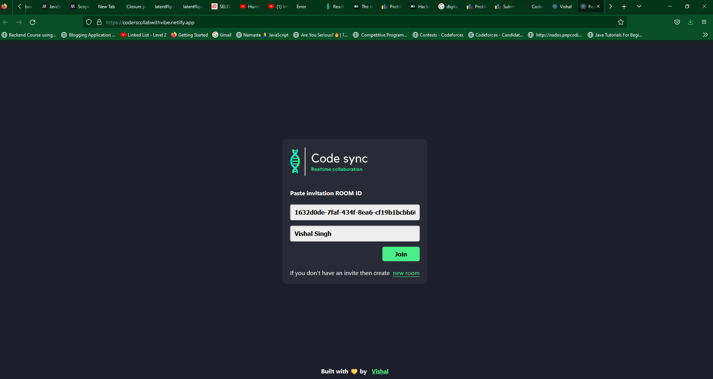
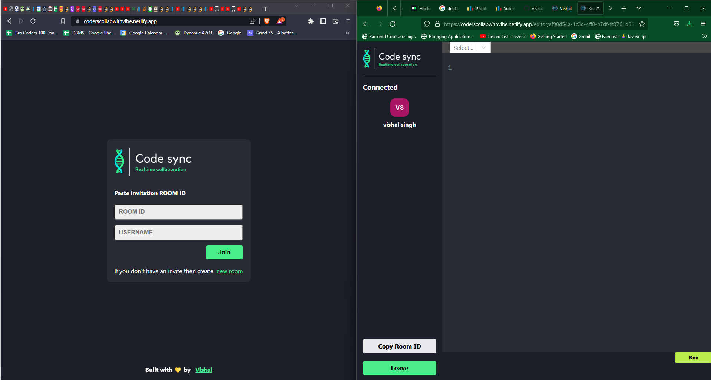
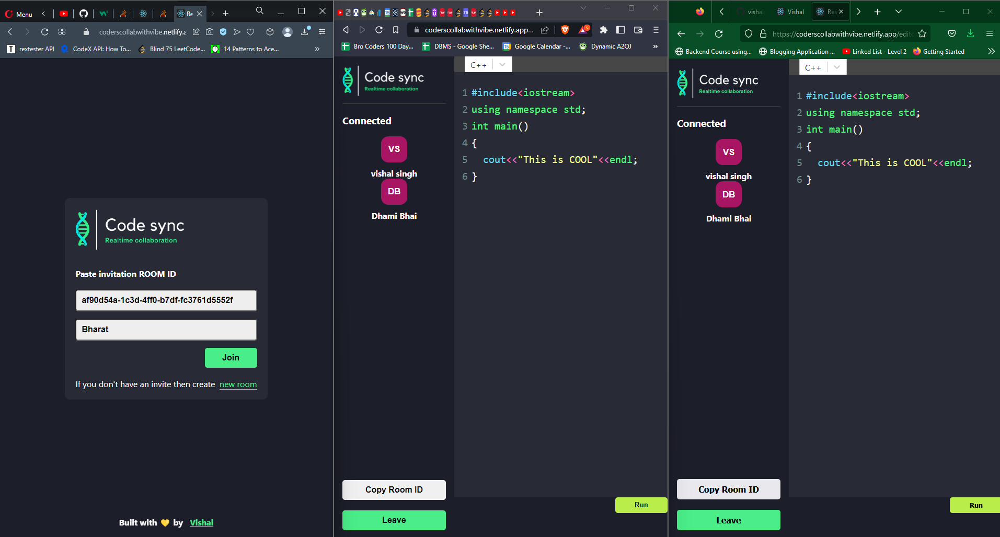
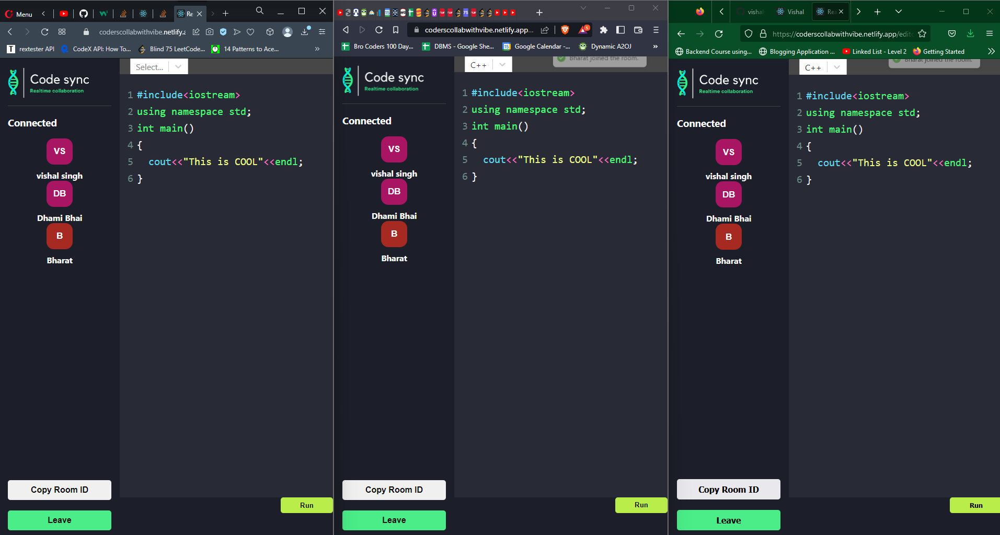

# Coders_Collab_Live
• Real-time collaborative coding web application with inbuilt Chatfeature and User Authentication. The changes are synchronized in real-time using web-sockets and Operational Transformations. It provides inbuilt judge support(for select languages)to run the code on custom input. • Technology Stack : HTML/CSS, JavaScript, Express (Back end), socket.io.

